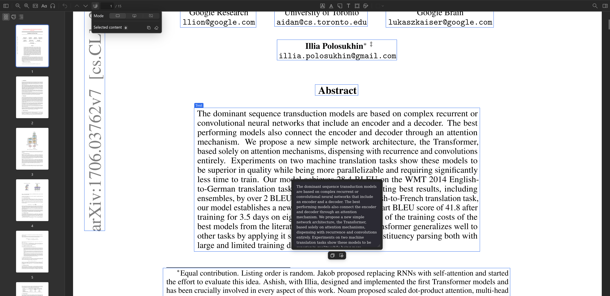
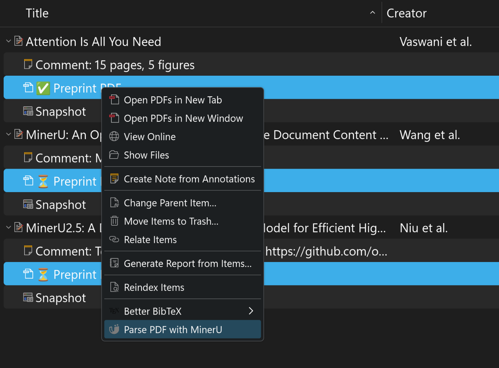
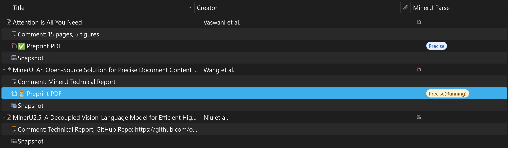
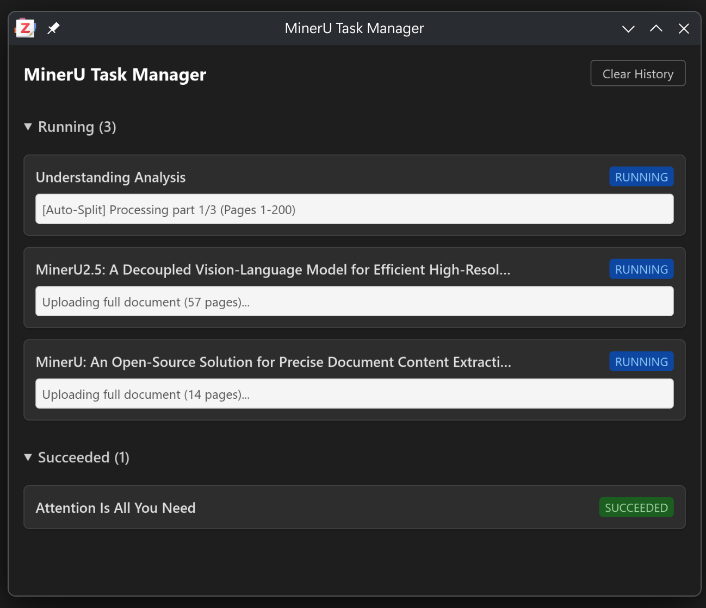
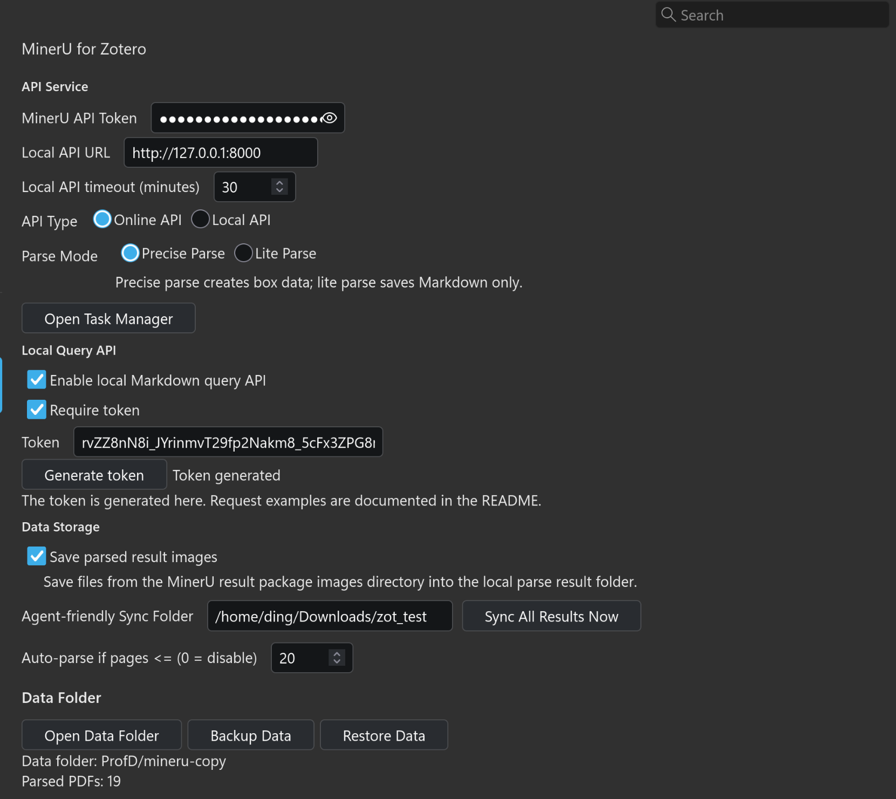

# MinerU for Zotero

[](https://www.zotero.org)
[](https://github.com/windingwind/zotero-plugin-template)

<p align="center">
    
</p>

## What You Can Do

- Parse one or more selected PDF attachments from the Zotero item list.
- Automatically handles PDFs over 200 pages by splitting, parsing, and seamlessly merging the results.
- Tracks processing jobs in the persistent **MinerU Task Manager** with status grouping (Running, Succeeded, Failed) and history clearing.
- Automatically adds Zotero tags (`MinerU: Precise ✅`, `MinerU: Lite ✅`, `MinerU: Failed ❌`, `MinerU: Processing ⏳`) based on parse status.
- Export results to an **Agent-friendly Sync Folder**, which automatically generates structured Markdown, images, and standard BibTeX metadata (`metadata.bib`) for each parsed PDF for seamless integration with downstream AI agents.
- Reuse an existing parse result, or reparse and replace it when needed.
- Show MinerU boxes in the Zotero PDF Reader.
- Switch between all boxes, hovered boxes, and off mode.
- Copy a single text, title, list, table, image caption, reference, formula, or other recognized box.
- Select multiple boxes with `Shift` or `Ctrl`, then copy them together in reading order.
- Copy the full parsed Markdown from the reader toolbar when no boxes are selected.
- Optionally save images from MinerU results into the local result folder.

## Requirements

- Zotero 8 or 9.
- A [MinerU API Key](https://mineru.net/apiManage/token).
- `pdftk` installed on your system (only required for PDFs larger than 200 pages; the plugin uses a built-in fallback for smaller files).
- PDF attachments that are available on this computer.

### Installing `pdftk`

<details>
<summary>macOS (Homebrew)</summary>

```shell
brew install pdftk-java
```

</details>

<details>
<summary>Linux (Fedora / RHEL)</summary>

```shell
sudo dnf install pdftk
```

</details>

<details>
<summary>Windows</summary>

Download the installer from [pdftk on chocolatey](https://community.chocolatey.org/packages/pdftk) or install via Chocolatey:

```powershell
choco install pdftk
```

</details>

## Setup

1. Install the plugin in Zotero.
2. Open `Edit` -> `Settings` -> `MinerU for Zotero`.
3. Get your API Key from [MinerU API Token Management](https://mineru.net/apiManage/token) and enter it.
4. Optional: enable `Save parsed result images` if you want images from MinerU results to be saved locally.

The API Key is stored only in local Zotero preferences.

## Parse a PDF

<p align="center">
    
</p>

1. In the Zotero item list, select one or more PDF attachments.
2. Right-click the selection and choose `Parse PDF with MinerU`.
3. Wait until Zotero shows `MinerU parsing finished`.
4. Open the parsed PDF in the Zotero PDF Reader.

If a selected PDF already has a parse result, choose one of these options:

- `Use existing result`: keep the current result and use it in the reader.
- `Reparse and overwrite`: submit the PDF again and replace the result after parsing succeeds.

If parsing fails during replacement, the existing usable result is kept.

<p align="center">
    
</p>

## Copy in the Reader

1. Open a parsed PDF.
2. Click the `MinerU boxes` button in the PDF Reader toolbar.
3. Choose a mode:
   - `Show all boxes`
   - `Show only hovered box`
   - `Disable plugin features`
4. Hover over a box and click `Copy`.
5. For formulas, choose `Copy with $` or `Copy without $`.

For multi-box copying, hold `Shift` or `Ctrl` while clicking boxes. Then use the toolbar menu to copy the selected content or clear the selection. If no boxes are selected, the same copy button copies the full parsed Markdown.

## Local Results & Task Manager

<p align="center">
    
</p>

Open `Edit` -> `Settings` -> `MinerU for Zotero` and click `Open Data Folder` to view local parse results. The settings page also shows how many PDFs currently have usable results.

You can also open the **MinerU Task Manager** from the settings page to view the real-time status of your parsing jobs, view error messages, and clear your history.

The result folder contains the parsed Markdown, box data used by the reader, and optional images. External tools may read these files, but editing them is not recommended.

### Agent-friendly Sync Folder

<p align="center">
    
</p>

For AI workflows, you can configure an **Agent-friendly Sync Folder** in the settings. When enabled, MinerU for Zotero will automatically copy parsed results (Markdown + images) into a clean, flat directory structure named after the citation key and title (`[CitationKey] - Title/`). 
It will also automatically generate a `metadata.bib` file containing the BibTeX metadata for each item. You can click `Sync All Results Now` in the settings to bulk-export all existing historical results to this folder.

This enables you to use AI Agents (like Cursor, Claude Desktop, etc.) to read the high-quality Markdown output directly. You can even equip your agent with the included CLI script (see below) to dynamically search and read files directly from the Zotero database!

## Local Markdown Query API

The local Markdown query API lets local external tools read Markdown parse results that MinerU for Zotero has already saved through Zotero's built-in local HTTP server. It only queries existing local results. It does not submit new MinerU parsing jobs or directly expose the plugin data folder.

Main capabilities:

- Search candidate Zotero items and PDF attachments by title keywords.
- Read Markdown for a regular Zotero item or PDF attachment with `libraryID + key`.
- Query at `full`, `headings`, `section`, or `search` granularity, so external agents can inspect structure before reading a section or keyword context.
- Pass `attachmentKey` to select a specific PDF when a regular item has multiple PDF attachments.
- Return precise Markdown first; if precise output is unavailable but lite output exists, return lite Markdown and mark it in `result.mode`.

### Configuration

1. Start Zotero and make sure MinerU for Zotero is enabled.
2. Open `Edit` -> `Settings` -> `MinerU for Zotero`.
3. In `Local Query API`, enable `Enable local Markdown query API`.
4. `Require token` controls whether callers must provide a token. When it is enabled, click `Generate token`.
5. When token validation is enabled, callers can send the token in the `Authorization: Bearer <token>` header. The API also supports a `token=<token>` query parameter.

Zotero's local port is usually `23119`. If you changed Zotero's local server port, replace the port in the examples below with your actual port.

### HTTP Examples

Search candidate items by title:

```shell
curl --get "http://127.0.0.1:23119/mineru-for-zotero/search" \
  --data-urlencode "libraryID=1" \
  --data-urlencode "title=retrieval augmented generation" \
  -H "Authorization: Bearer <token>"
```

Read the full Markdown:

```shell
curl "http://127.0.0.1:23119/mineru-for-zotero/markdown?libraryID=1&key=ABCD1234" \
  -H "Authorization: Bearer <token>"
```

Read only the heading hierarchy:

```shell
curl "http://127.0.0.1:23119/mineru-for-zotero/markdown?libraryID=1&key=ABCD1234&granularity=headings" \
  -H "Authorization: Bearer <token>"
```

Read a specific section:

```shell
curl --get "http://127.0.0.1:23119/mineru-for-zotero/markdown" \
  --data-urlencode "libraryID=1" \
  --data-urlencode "key=ABCD1234" \
  --data-urlencode "granularity=section" \
  --data-urlencode "sectionPath=Introduction/Background" \
  -H "Authorization: Bearer <token>"
```

Search Markdown and return surrounding paragraphs:

```shell
curl --get "http://127.0.0.1:23119/mineru-for-zotero/markdown" \
  --data-urlencode "libraryID=1" \
  --data-urlencode "key=ABCD1234" \
  --data-urlencode "granularity=search" \
  --data-urlencode "q=retrieval" \
  --data-urlencode "contextParagraphs=2" \
  -H "Authorization: Bearer <token>"
```

Common parameters:

| Parameter           | Endpoint             | Description                                                                |
| ------------------- | -------------------- | -------------------------------------------------------------------------- |
| `libraryID`         | `search`, `markdown` | Zotero library ID. Personal libraries are usually `1`.                     |
| `title`             | `search`             | Title keyword used to find candidate Zotero items.                         |
| `key`               | `markdown`           | Zotero regular item key or PDF attachment key.                             |
| `attachmentKey`     | `markdown`           | Selects the target PDF attachment when a regular item contains PDFs.       |
| `granularity`       | `markdown`           | `full`, `headings`, `section`, or `search`. Defaults to `full`.            |
| `sectionPath`       | `markdown`           | Heading path for `section` queries, for example `Introduction/Background`. |
| `q`                 | `markdown`           | Keyword used by `search` queries.                                          |
| `contextParagraphs` | `markdown`           | Number of context paragraphs around each `search` match.                   |

Common error codes:

- `api-disabled`: the local Markdown query API is not enabled in settings.
- `invalid-token`: the token is missing or does not match.
- `ambiguous-attachment`: the regular item has multiple PDFs; pass `attachmentKey`.
- `parse-result-not-found`: the target PDF has no usable parse result yet; parse it in Zotero first.
- `section-not-found`: the section path does not match; run `granularity=headings` first to inspect exact paths.
- `missing-query`: `granularity=search` was used without `q`.

### AI Agent Integration (Companion Skill)

The repository includes a companion Skill in the `mineru-for-zotero-cli/` folder, which is designed to teach AI Agents (like Cursor, Claude Desktop, or local LLMs) how to query your local Zotero database directly.

To equip your Agent with this skill:
1. Direct your Agent to read the `mineru-for-zotero-cli/SKILL.md` file. This file contains the complete system prompt, context, and command workflows the Agent needs to interact with the local API.
2. The Agent can then use the bundled Node.js script (`query-markdown.mjs`) to autonomously execute commands (e.g., `search`, `headings`, `section`) directly against your running Zotero client.

This integration abstracts away HTTP parameters, port detection, and error handling, providing the Agent with a clean, text-optimized interface for traversing complex academic documents without overflowing its context window.

### Example Agent Workflow

Because the CLI output is heavily optimized for LLM consumption, external agents can autonomously traverse complex academic documents. 

For example, when an AI Agent is tasked to analyze the paper *Attention Is All You Need* using this CLI, it successfully executes the following steps completely autonomously:

<details>
<summary>Click to view the Agent's autonomous test report</summary>

**✅ Step 1 — Search & Identify (`search --title`)**
The agent queries the title, identifies the item `D634TSCH`, and confirms that the precise parse result exists.

**✅ Step 2 — Structure Extraction (`markdown --granularity headings`)**
The agent extracts the 25-node heading tree (Abstract → 1 Introduction → ... → 7 Conclusion) to understand the document's structure without loading the full text into context.

**✅ Step 3 — Targeted Section Reading (`markdown --granularity section`)**
The agent precisely targets `Attention Is All You Need / 3.2.1 Scaled Dot-Product Attention` and successfully extracts the exact LaTeX formula:
`\operatorname{Attention}(Q, K, V) = \operatorname{softmax}\left(\frac{QK^{\mathsf{T}}}{\sqrt{d_k}}\right)V`

**✅ Step 4 — Contextual Search (`markdown --granularity search`)**
By searching for `"Table 1"` with `--context-paragraphs 2`, the agent accurately locates the layer complexity table and perfectly recreates it in Markdown format, pulling the exact explanation of why Self-Attention is faster ($O(1)$ sequential operations vs $O(n)$ for Recurrent).

**✅ Step 5 — Full Document Fetching (`markdown --granularity full`)**
The agent fetches the full Markdown and flawlessly lists all 8 authors and their affiliations from the header.

</details>

## Troubleshooting

### API Key Not Configured

Open the plugin settings page, enter your MinerU API Key, and try again.

### File Access Failed

Make sure the PDF is available locally. If the attachment is cloud-only or still syncing, open or download it in Zotero first.

### The Reader Says No Parse Result Is Available

Parse the PDF first. If you already parsed it, open the data folder from the settings page and confirm that the parsed result still exists.

### Boxes Are Not Visible

Confirm that the toolbar mode is not set to `Disable plugin features`. If the PDF was parsed but still has no boxes, reparse it.

### Result Download Failed

The MinerU result download may be temporarily unavailable. Try again later or reparse the PDF.

## Development

Install dependencies:

```shell
npm install
```

Start development mode:

```shell
npm start
```

Run tests, checks, and build:

```shell
npm test
npm run lint:check
npm run build
```

## License

AGPL-3.0-or-later
